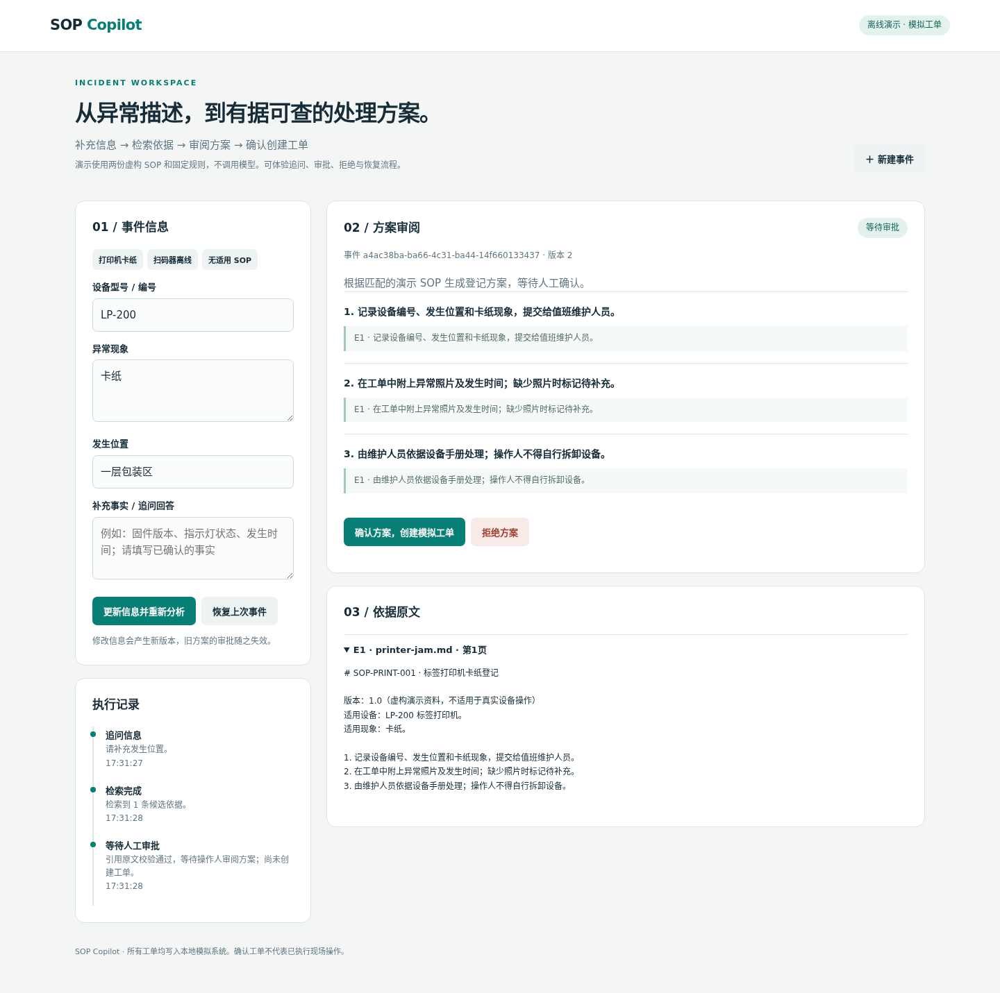
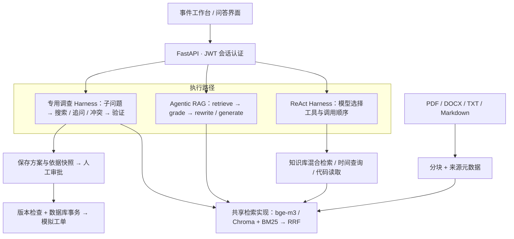

<div align="center">

# SOP Copilot

**面向 SOP 事件处理的证据调查 Agent：跨文档检索、缺口追问与逐步骤支持检查。**

Task Decomposition · Adaptive Retrieval · Conflict Detection · Grounded Verification

[快速体验](#快速体验) · [系统架构](#系统架构) · [技术实现](#技术实现) · [测试与评测](#测试与评测) · [设计取舍](docs/incident-design.md)

</div>

SOP Copilot 将内部操作文档转化为可检索的知识库，支持带来源的问答，以及设备异常的事件登记。系统收集必要信息、检索适用依据、生成结构化方案，由操作人审阅具体版本后创建模拟工单，并保存可恢复的执行记录。

项目围绕三个工程问题展开：**如何找到正确依据，如何约束模型输出，如何保证审批与执行一致。**

| 任务调查 | 证据决策 | 可验证实现 |
| --- | --- | --- |
| 拆解子问题，跟踪证据覆盖 | 区分继续搜索、追问事实与停止 | 41 项回归测试通过 |
| 根据缺口检索被引用的其他 SOP | 冲突来源保留双方原文，转交人工 | 8 个跨文档、条件与冲突评测案例 |
| 累积与去重证据，限制调查预算 | 生成后独立核对逐步骤语义支持 | 单次检索 vs 自适应调查对照脚本 |




> **演示场景**：包装区的 LP-200 打印机卡纸。系统先追问缺失的位置，检索对应 SOP，再起草带原文引用的登记方案。操作人确认后创建模拟工单；重复提交同一审批返回同一结果，刷新或重启后可恢复已保存状态。

## 系统架构

项目采用两类控制方式：**固定 Agentic RAG**，以及 **ReAct 风格的模型驱动循环**。后者分别实现为通用工具调用 Harness 和面向 SOP 的专用调查 Harness，因此代码提供三个业务入口，而非三种互斥的 Agent 范式。



| 路径 | 控制方式 | 状态与持久化 |
| --- | --- | --- |
| **事件处理** `/incidents` | 模型拆解任务并选择调查动作；控制器约束预算、覆盖和证据；独立 API 审批 | 异步 SQLite 保存事实、方案、依据、决定与模拟工单 |
| **知识问答** `/chatbot/chat` | LangGraph 固定检索流程，资料不足时有界改写，最终回答或拒答 | PostgreSQL Checkpointer 保存对话状态 |
| **工具调用实验** `/harness/chat` | `create_agent` 自主选择工具；中间件提供检索结果反馈和历史摘要 | MemorySaver，当前不跨重启恢复 |

三条路径共用 `search_sop` **混合检索服务**，使用相同的候选数量、向量距离阈值、BM25 与 RRF 配置。固定图决定何时检索，ReAct 由模型选择是否调用检索工具，`ResearchAgent` 根据证据缺口继续查询；调查器不经过问答图的 grade/rewrite 循环。统一检索后端可以减少编排方式对照中的检索差异，但不代表三条路径的提示词、调用预算或评审机制也完全一致。

## 技术实现

### 1. 专用调查 Harness：针对证据缺口决定下一步

真实事件入口已接入 `ResearchAgent`。先把事件拆成最多四个需要依据的子问题，再根据累计证据选择动作：

```text
plan → search → assess ── answer ──→ draft → verify → 人工审阅
                  ├── search  ──→ 针对缺口检索，合并与去重证据
                  ├── clarify ──→ 向用户索取未确认事实
                  ├── conflict ─→ 保存双方原文，停止生成
                  └── abstain ──→ 说明证据不足并停止
```

例如设备 SOP 只写“填写 FORM-JAM-9”，Agent 可以继续查询该表单；若处理分支取决于固件版本，则追问用户；若两份适用通知互相矛盾且没有明确替代关系，则交由人工确认。

- **覆盖门槛**：每个子问题必须关联已检索的证据 ID，遗漏子问题、重复覆盖索引或伪造 ID 都不能进入生成。
- **冲突定位**：冲突结果必须带两个不同来源的逐字引文，便于人工核对；发布日期本身不作为替代关系。
- **语义支持检查**：独立模型调用逐步骤核对 instruction 是否被原文支持。漏判、重复判定、不支持或引用不匹配均停止提交。
- **有界探索**：默认最多 3 次检索、6 次模型服务调用、80 秒、16 个证据片段 / 24,000 字符；规范化后重复的查询直接停止。
- **可检查轨迹**：保存子问题、实际查询、来源 ID、判定结果、调用数与耗时；页面支持填写追问回答并重新调查。

语义与冲突判断仍依赖模型，可能出错；硬约束保证的是覆盖结构、引用存在、执行预算与状态边界。模型服务内部可能重试，因此服务调用次数不是提供商请求数或 Token 成本。

源码：[调查控制器](app/core/incidents/research.py) · [模型适配器](app/core/incidents/live.py) · [17 项策略回归](tests/test_research.py)


### 2. 混合检索：同时覆盖语义表达与精确术语

SOP 查询既包含“扫码器无法联网”这样的自然语言，也包含设备型号、SOP 编号等精确标识。检索层分别生成向量和关键词候选，再按排名融合：

- **语义召回**：bge-m3 编码，Chroma 返回候选；向量距离阈值过滤明显不相关的结果。
- **关键词召回**：jieba 分词与 BM25，补充型号、编号等术语匹配。
- **RRF 融合**：使用候选的排名，而非直接相加尺度不同的向量距离与 BM25 分数。
- **来源追踪**：分块保留 `chunk_id`、`document_id`、文件名与页码；Markdown 按标题结构切分，过长章节继续细分。

```text
RRF(d) = Σ 1 / (k + rank_r(d))
```

对向量与 BM25 排名分别求和；`rank_r(d)` 从 1 开始，某路未召回的片段不参与该路求和。

默认每路取 15 个候选，融合后返回 Top-5，RRF 的平滑常数为 60；参数均可配置。向量阈值只作用于向量候选，下游仍需判断资料是否足以支持回答。

源码：[共享检索服务](app/core/rag/retrieval.py) · [图节点](app/core/langgraph/nodes/retrieve.py) · [RRF](app/core/rag/fusion.py) · [结构化分块](app/core/rag/splitter.py)

### 3. 有界问答：资料不足时改写，耗尽预算后拒答

问答路径将检索质量判断建模为显式状态，而非仅在提示词中要求“不要编造”：

```text
retrieve → grade ── 资料充分 ──→ generate
             │
             └── 资料不足 ──→ rewrite → retrieve
                    │
                    └── 达到改写上限 ──→ 明确拒答
```

`GradeResult` 返回结构化的充分性判断，`rewrite_count` 限制循环次数，默认最多改写两次。生成节点再次检查资料与判定结果，失败时直接返回拒答，不再调用回答模型。SSE 仅输出最终生成节点的内容，并兼容无 LLM 调用的直接拒答。

LLMService 将重试、模型回退与单次服务调用的总超时集中管理；事件规划另设 90 秒预算。真实事件规划调用传递 Langfuse 回调和用户元数据，页面展示检索、校验与审批结果。

源码：[LangGraph 编排](app/core/langgraph/graph.py) · [拒答门槛](app/core/langgraph/nodes/generate.py) · [LLMService](app/services/llm/service.py)

### 4. 结构化方案：把模型建议转化为可校验的契约

事件输入必须具备设备、异常现象与位置，缺项先追问，不进入规划。模型只返回 `Proposal`，每个步骤包含：

```json
{
  "instruction": "记录设备编号、发生位置和卡纸现象，提交给值班维护人员。",
  "evidence_id": "E1",
  "quote": "记录设备编号、发生位置和卡纸现象，提交给值班维护人员。"
}
```

Pydantic 校验输出结构，服务端继续检查引用 ID 是否存在、引文是否为对应来源的连续原文。无依据、空步骤、引用不匹配或规划失败时，事件进入 `blocked`；只有通过检查的方案才能进入 `awaiting_approval`。

**原文匹配之后，真实调查路径还会进行独立的逐步骤模型支持检查，最终交由操作人核对。** 方案和依据原文一同保存，审批时可以直接比对。

源码：[数据契约](app/core/incidents/schemas.py) · [证据检查与状态迁移](app/core/incidents/service.py) · [真实规划器](app/core/incidents/live.py)

<details>
<summary><strong>工程支撑：版本化审批、并发与恢复</strong></summary>


规划与执行分离：LLM 没有写工单权限，审批请求仅提交 `expected_version` 与决定。服务端通过以下约束保证用户审阅的版本与落库结果一致：

| 故障或竞争场景 | 处理机制 |
| --- | --- |
| 用户修改事实后提交旧审批 | 重新规划保存时递增版本；旧 `expected_version` 返回 HTTP 409 |
| 分析尚未完成，另一请求已审批 | 规划在事务外运行；保存采用 compare-and-swap，禁止覆盖已更新状态 |
| 双击、并发确认或响应丢失后重试 | `BEGIN IMMEDIATE` 串行化决定；同一版本与决定幂等返回 |
| 审批记录成功但工单创建失败 | 决定、模拟工单与最终快照在同一事务提交；`incident_id` 唯一约束防重复 |
| 刷新或进程重启 | 从数据库恢复已保存的追问、待审批与终态快照 |
| 其他用户访问事件 | 从认证会话派生 owner，读写均检查归属 |

这一原子性保证适用于**同一本地数据库中的模拟工单**。接入外部工单系统需要 outbox、稳定幂等键与结果对账；正在执行的模型调用尚无中间检查点。

源码：[事务与版本控制](app/core/incidents/store.py) · [认证入口](app/api/v1/incidents.py) · [并发与故障测试](tests/test_incidents.py)

</details>

## 测试与评测

**已验证：41 项回归测试通过，Pyright 零错误 / 零警告，Ruff lint 与格式检查通过。** 浏览器验证覆盖追问、方案审阅、审批、刷新恢复和移动端布局。详见[验证记录](docs/validation.md)。

| 验证层 | 覆盖内容 | 当前证据 |
| --- | --- | --- |
| 调查策略 | 跨文档缺口、覆盖伪造、语义不支持、冲突引文、重复搜索、预算、超时与追问恢复 | [17 项调查测试](tests/test_research.py)，脚本化模型接口 |
| 共享检索 | 三路径排序与来源一致、空结果、文档过滤、向量对照模式、改写与 Top-k | [5 项检索回归](tests/test_shared_retrieval.py) |
| 流程与 API | 缺失信息、伪造引用、上游失败、用户隔离、拒绝、并发审批、过期版本、恢复 | [14 项流程测试](tests/test_incidents.py) |
| RAG 回归 | 无依据拒答、内部流过滤、直接拒答流、消息序列化与正常生成 | [5 项 RAG 测试](tests/test_rag_safety.py)，模型调用使用替身 |
| 离线场景 | 两组已知事件、信息缺失与无适用 SOP | [6 / 6 流程报告](docs/workflow-report.json)，固定规则适配器 |
| 调查对照 | 跨文档、条件分支、冲突、无依据、提示注入 | [8 个难例](examples/research/cases.json)与[真实模型对照脚本](evals/research.py)，结果待测 |
| 检索对照 | 相同查询与 Top-k 下比较 vector / hybrid | [12 条标注查询](examples/retrieval-cases.json)与[评测脚本](evals/retrieval.py)，真实检索结果待测 |

检索报告输出**文档级 Recall@k、MRR@k、负例空结果率、逐查询耗时**，保留每个问题的预期文档与实际命中，便于分析失败。当前语料为两份合成 SOP，用于验证实验链路；离线流程通过率不作为模型准确率。实验口径、冷启动影响与数据限制见[评测说明](docs/portfolio-evaluation.md)。

```bash
# 独立轻量环境：流程契约测试与离线评测
.venv-demo/bin/python -m pytest tests/test_incidents.py -q
make eval-workflow

# 完整开发环境：全量回归、静态检查与真实检索对照
make test
make check
uv run ruff format --check .
make eval-retrieval  # 先上传示例 SOP 并等待处理完成
uv run python -m evals.research --runs 3 --judge  # 使用独立知识库，上传 examples/research/sops/ 全部文件
```

## 快速体验

### 离线演示 · 无需 API Key

需要 Python 3.13+ 和 uv，在仓库根目录运行：

```bash
make demo-install
make demo
```

打开 **http://127.0.0.1:8000**。选择「打印机卡纸」，先留空位置体验追问；补齐后查看引用并确认工单。刷新后点击「恢复上次事件」，或新建「无适用 SOP」事件体验阻止执行。

离线演示使用两组固定规则，展示基本登记与审批；自适应调查使用下方真实模型入口。离线模式共用业务持久化和审批 API，仅适合本机单用户体验。

<details>
<summary>Windows 启动命令</summary>

```powershell
uv venv .venv-demo
uv pip install --python .venv-demo/Scripts/python.exe -r requirements-demo.txt
.venv-demo/Scripts/python.exe -m uvicorn app.demo:app --host 127.0.0.1 --port 8000
```

</details>

### 真实模型与知识库

```bash
cp .env.example .env
# 填写模型 API Key、JWT_SECRET_KEY，核对模型名称与数据库配置
uv sync --extra cache --group test
docker compose up -d db valkey
uv run alembic upgrade head
uv run uvicorn app.main:app --host 127.0.0.1 --port 8000
```

打开 `/ui/`，注册/登录，上传 `examples/sops/` 中两份 Markdown，等待处理完成后进入事件工作台。体验跨文档与冲突调查时，上传 `examples/research/sops/` 中全部文件，按[难例清单](examples/research/cases.json)填入事件事实与补充信息。首次启动需要下载 bge-m3 模型。配置与既有问答接口见 [RAG / ReAct 文档](docs/rag-baseline.md)。两种模式创建的均为本地模拟工单。

## 技术栈与代码导航

| 模块 | 技术与实现 | 入口 |
| --- | --- | --- |
| 编排与模型 | LangGraph、LangChain、DeepSeek 兼容接口、Pydantic、tenacity | [问答图](app/core/langgraph/) / [ReAct](app/core/harness/) / [LLM 服务](app/services/llm/) |
| 文档与检索 | 多格式解析、标题分块、bge-m3、Chroma、BM25、RRF | [RAG 组件](app/core/rag/) |
| 业务流程 | Planner 协议、显式状态机、结构化方案、版本化审批 | [事件核心](app/core/incidents/) |
| 状态存储 | PostgreSQL 对话检查点；aiosqlite 事件与模拟工单快照 | [问答持久化](app/core/langgraph/graph.py) / [事件存储](app/core/incidents/store.py) |
| 接口与界面 | FastAPI、JWT、SSE、原生 HTML / JavaScript | [API](app/api/v1/) / [工作台](static/incidents.html) |
| 可观测与验证 | Langfuse、structlog、Prometheus/Grafana 集成、pytest、Pyright、Ruff | [测试](tests/) / [评测](evals/) / [CI](.github/workflows/ci.yaml) |

## 设计边界与后续方向

当前面向单机演示与工程验证：事件按用户隔离，知识库共享；提交人可审批自己的方案。真实模型质量、成本及完整外部服务部署尚未验证。

后续重点是领域语料与人工标注、SOP 版本有效期及适用性检查、独立审批角色、文档权限，以及外部工单的 outbox 与对账。完整取舍见[设计说明](docs/incident-design.md)。

## 来源与许可

项目基于 [fastapi-langgraph-agent-production-ready-template](https://github.com/wassim249/fastapi-langgraph-agent-production-ready-template)，复用认证、基础数据库、监控及部分 LLM 基础设施；在此基础上扩展 SOP 检索与问答、工具调用实验，以及版本化事件审批闭环。遵循 [MIT License](LICENSE)，保留原始来源与版权说明。
